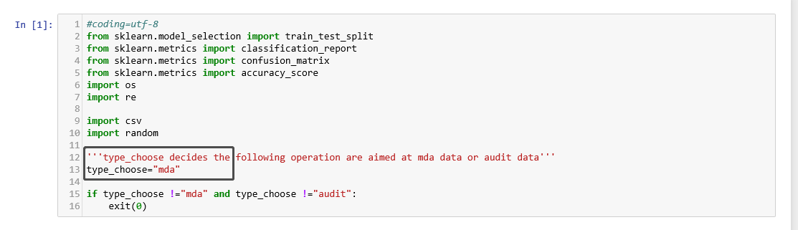

&emsp;&emsp;这部分代码涉及数据的预处理，总体输入是```../../raw_data```,总体输出是```../../mid_data/waiting_to_allocate```, 每一个ipynb会产生一些中间数据，在后续中有用。  
&emsp;&emsp;如果您想复现数据预处理的过程，请首先[点击此处](https://pan.baidu.com/s/1tZ0hlIhZAtpc_6hvbQ7JlQ)下载待处理的数据集。  
&emsp;&emsp;如果您已经有了对应的训练数据或者只想运行模型部分的代码，可以跳过本文件夹，直接运行[model_code](../model_code)中的代码。  
以下会介绍本文件夹中每个ipynb的功能并产生的中间数据。
***  
<br></br>
              
# data_clean.ipynb
   __input路径:__  
   &emsp;&emsp; ../../raw_data  
   __output路径:__  
   &emsp;&emsp; ../../mid_data/mda_clean1   
   &emsp;&emsp; ../../mid_data/audit_clean1   
   &emsp;&emsp; ../../mid_data/mda_clean2  
   &emsp;&emsp; ../../mid_data/audit_clean2  
   &emsp;&emsp; ../../mid_data/untagged_mda  
   &emsp;&emsp; ../../mid_data/untagged_audit   
            
#### 变量设置：在路径正确的情况下，跑代码前需要设置的只有```type_choose```

#### 代码说明：  
&emsp;&emsp;代码主要分成三部分。  
&emsp;&emsp;第一部分“First clean”,用于原始数据的去噪，输入../../raw_data,输出../../mid_data/mda_clean1或者../../mid_data/audit_clean1(取决于```type_choose```的设置，下同）。  
&emsp;&emsp;第二部分“Second Clean: Setences Slicing”,用于按照规则切取有意义的句子，提取标识信息进行数据结构化。输入../../mid_data/mda_clean1或../../mid_data/audit_clean1，输出../../mid_data/mda_clean2或../../mid_data/audit_clean2(clean_2部分的数据是完整的年报数据，在评估年报两部分评分时需要使用）。  
&emsp;&emsp;第三部分“Cleaned Repeated Sentences And Shuffle”,用于去除重复内容的句子并且随机，为了提高人工标注的效率。输入../../mid_data/mda_clean2或../../mid_data/audit_clean2，输出../../mid_data/untagged_mda或../../mid_data/untagged_audit。  
<br></br>  

# data_allocate.ipynb
__input路径:__  
&emsp;&emsp; ../../mid_data/untagged_mda  
&emsp;&emsp; ../../mid_data/untagged_audit  
__output路径:__  
&emsp;&emsp; ../../mid_data/waiting_to_allocate  
### 变量设置：  
&emsp;&emsp;mda_total：../../mid_data/untagged_mda&emsp; 中csv的个数  
&emsp;&emsp;audit_total：../../mid_data/untagged_audit&emsp; 中csv的个数   
&emsp;&emsp;mda_num：随机挑选多少个mda的csv进行分配  
&emsp;&emsp;audit_num：随机挑选多少个audit的csv进行分配  
### 代码说明：
&emsp;&emsp;这个ipynb的代码主要用于将data_clean.ipynb中处理数据后得到的在../../mid_data/untagged_mda和../../mid_data/untagged_audit中的csv随机挑选指定个数进行人工分配。方便后续人工标注，任务的目的性强，处理流程并不通用，为了防止后续处理产生问题，文件分发过程中保留了中间数据。  
&emsp;&emsp;__分法要求：__    
&emsp;&emsp;&emsp;&emsp;1. 每个文件复制三遍，要求分别分发给不同的三个人；  
&emsp;&emsp;&emsp;&emsp;2. 要求不能任何两个人分发到的文件不能一模一样。  
&emsp;&emsp;  
&emsp;&emsp;__命名规则：__    
&emsp;&emsp;在原文件后面加上后缀，例如原文件“audit_sentence1.csv”，第一份副本“audit_sentence1_0.csv”，第二份副本“audit_sentence1_1.csv”，第三份副本“audit_sentence1_2.csv”。  
&emsp;&emsp;代码主要分成两个部分。  
&emsp;&emsp;第一部分代码功能是随机挑选指定个数mdv和audit文件，复制到&emsp;../../mid_data/waiting_to_allocate &emsp;文件夹。  
&emsp;&emsp;第二部分代码用于将上一步随机抽取出的文件分给若干个人。在指定路径&emsp;../../mid_data/sentence_allocate/&emsp;为每个人建立新文件夹，按次序把每个副本分发给每个新文件夹。例如：“audit_sentence1_0.csv”分给“A”，“audit_sentence1_1.csv”分给“B”，“audit_sentence1_1.csv”分给“C”，“audit_sentence2_0.csv”分给“D”，以此类推。  
<br></br>
# extract_trainset.ipynb  
__input路径__:   
&emsp;&emsp; ../../mid_data/sentence_allocate  
&emsp;&emsp; ../../mid_data/checked_tag_data/mda_data&emsp;或&emsp;../../mid_data/checked_tag_data/audit_data  
__output路径__:   
&emsp;&emsp;../../mid_data/training_data/mda_data&emsp;或&emsp;../../mid_data/training_data/audit_data  
### 代码说明：  
&emsp;&emsp; data_allocate.ipynb为数据标注生成了待标注的csv，将标注完成的audit的csv放到&emsp; ../../mid_data/checked_tag_data/audit_data&emsp;（mda的放到&emsp; ../../mid_data/checked_tag_data/mda_data）。  从这些csv文件中提取出有效数据集“data.csv”。用于后续处理。  
&emsp;&emsp;__提取规则：__  
&emsp;&emsp;在没有遗漏的情况下，每条data都会有三次标注。如果有两条或以上的标注相同，则将该条数据用多人认可的标签写入data.csv，将与多数标签不同的该条找到标注者信息然后写入wrong.csv。如果三条标注的标签都不相同，把三种标签和该条item连结，写入unsure.csv。  
&emsp;&emsp;在有遗漏的情况下，如果某个data只有一次标注，则舍弃。如果有两次标注，这两次标注相同，则将该条数据写入data.csv。  
&emsp;&emsp;data.csv的位置在output路径中。


  
